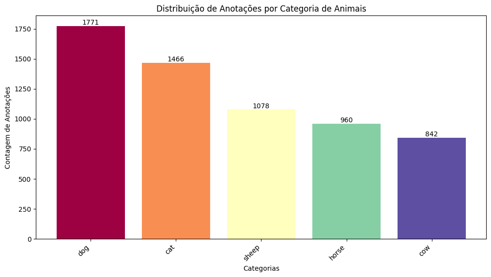
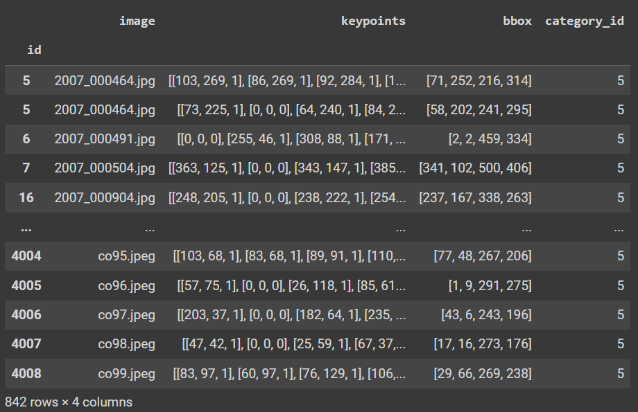
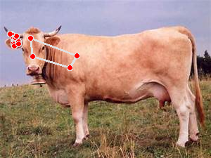
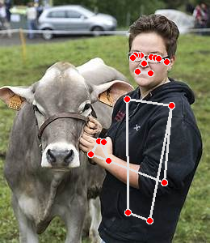

# Pose Estimation para Bovinos

Este projeto analisa e estima a pose especificamente nos bovinos. Utiliza-se um dataset com anotações de poses, incluindo categorias como cães, gatos, ovelhas, cavalos e bois. O objetivo é explorar a distribuição de anotações, filtrar os dados específicos de bovinos e aplicar a estimativa de pose com a biblioteca MediaPipe.

## 1. Distribuição de Anotações por Categoria de Animais

Foi gerado um gráfico de barras para representar a contagem de anotações por cada categoria de animal no dataset. As categorias incluem diferentes espécies e a análise permite identificar quais têm mais dados anotados.

- **Gráfico de Distribuição de Anotações por Categoria**:

    

- **Descrição**: O gráfico revela que a categoria de cães (*dog*) possui o maior número de anotações (1771), seguida por gatos (*cat*) com 1466, ovelhas (*sheep*) com 1078, cavalos (*horse*) com 960, e bovinos (*cow*) com 842 anotações. Essa distribuição desigual pode impactar o balanceamento ao treinar modelos de aprendizado de máquina.

## 2. **Filtragem de Anotações de Bovinos**

Após filtrar as anotações de bovinos (categoria com `category_id = 5`), foi determinado o número total de imagens e anotações disponíveis.

- **Total de Anotações de Bovinos**:
  ```
  Total de anotações de bovinos (cows): 842
  ```

- **Descrição**: O dataset contém 842 anotações relacionadas a bovinos, uma quantidade razoável para o treinamento e avaliação de modelos de estimativa de pose.

## 3. **Tabela com Anotações e Informações de Imagens de Bovinos**

Foi realizada a combinação (merge) entre as anotações de bovinos e os metadados das imagens, resultando em um DataFrame que inclui o identificador da imagem, o caminho do arquivo, os pontos-chave (keypoints), as caixas delimitadoras (bbox), e a categoria.

- **DataFrame Final**:

    

- **Descrição**: O DataFrame contém todas as informações necessárias para a estimativa de pose dos bovinos, incluindo o caminho das imagens e as coordenadas dos pontos-chave que descrevem a pose.

## 4. **Resultados da Estimativa de Pose com MediaPipe**

Após a filtragem, o MediaPipe foi utilizado para realizar a estimativa de pose nas imagens de bovinos. As landmarks (pontos de articulação) dos animais foram detectadas e as conexões entre esses pontos desenhadas.

- **Exemplo de Imagens Anotadas com Estimativa de Pose**:

    
    

- **Descrição**: As imagens acima mostram os resultados da pose detectada em bovinos. Os pontos-chave e conexões foram traçados para representar a estrutura do corpo dos animais, similar ao que se faz com a estimativa de pose humana.

Essa experiência ampliou meu entendimento sobre estimativa de pose usando o MediaPipe. Percebi que preciso re-treinar o modelo com dados de bovinos para melhorar sua eficácia no monitoramento. O modelo MediaPipe, ao focar no treinamento humano, dificulta a detecção de bovinos. Embora consiga identificar alguns animais, os keypoints estão frequentemente mal posicionados. Isso evidencia a necessidade de um conjunto de dados específico para bovinos.